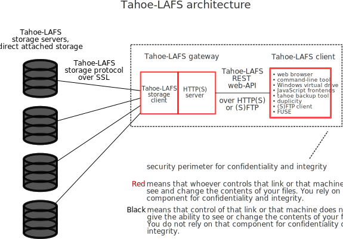

Welcome to The Least-Authority File Store
=========================================

:url:
:save_as: index.html

Tahoe-LAFS is a Free and Open decentralized cloud storage system. It
distributes your data across multiple servers. Even if some of the
servers fail or are taken over by an attacker, the entire file store
continues to function correctly, preserving your privacy and security.

A one-page summary_ explains the unique properties of this system.

Get Involved
------------

- Join the tahoe-dev_ mailing list and subscribe to tahoe-announce_
- Join the #tahoe-lafs IRC channel on Freenode
- Get the source code and start hacking_.

Read Some Nice Docs
-------------------

- `Installation Instructions <install_>`_
- `Tahoe-LAFS Manual <manual_>`_ (tahoe-lafs.readthedocs.org)
- `Index of docs <docs_>`_
- `Frequently Asked Questions <faq_>`_

.. _summary: https://tahoe-lafs.org/trac/tahoe-lafs/browser/git/docs/about.rst  

.. _tahoe-dev: https://tahoe-lafs.org/cgi-bin/mailman/listinfo/tahoe-dev  
.. _tahoe-announce: https://tahoe-lafs.org/cgi-bin/mailman/listinfo/tahoe-announce
.. _hacking: https://tahoe-lafs.org/trac/tahoe-lafs/wiki/Dev

.. _install: http://tahoe-lafs.readthedocs.org/en/latest/INSTALL.html
.. _manual: http://tahoe-lafs.readthedocs.org/
.. _docs: https://tahoe-lafs.org/trac/tahoe-lafs/wiki/Doc
.. _faq: https://tahoe-lafs.org/trac/tahoe-lafs/wiki/FAQ
